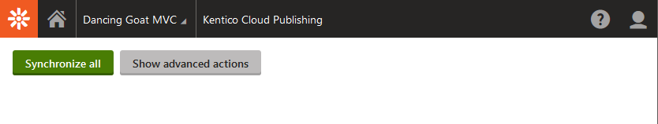
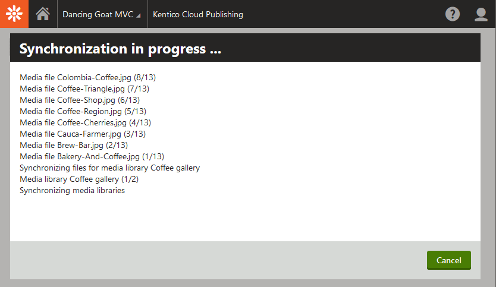

# Publishing content from Kentico EMS to Kentico Cloud

[](https://stackoverflow.com/tags/kentico)

:warning: DISCLAIMER: This is a sample, it needs detailed testing and maybe some fixing for real production usage. See also [Known issues and TODOs](#known-issues-and-todos).

This repository contains source code of the Kentico Cloud publishing module for Kentico EMS.

The module automatically synchronizes all published content and assets (media files, page attachments) from a specific site in [Kentico EMS](https://www.kentico.com) to a specific project in [Kentico Cloud](https://www.kenticocloud.com) using Kentico Cloud Content Management API.

NOTE: The publishing only handles the direction from Kentico EMS to Kentico Cloud, not vice-versa.

The typical use cases for the module are:
* Providing a reliable headless endpoint for your additional channels, e.g. mobile application
  * The data shouldn't be edited in Kentico Cloud, as they may be ovewritten by changes in Kentico EMS. You can still observe and navigate data in Kentico Cloud while developing or debugging your target application.  
* Migrating data to Kentico Cloud

## How to use this repository

### Manual installation with the source code from repository

Copy the contents of this repository to the root of your Kentico EMS installation.

You can do that by cloning the repository to a local folder (other than your Kentico EMS folder), and then copy the files over to your Kentico EMS folder.

NOTE: Only the files from following folders are necessary for the module, you can ignore the rest of the files:
* `/KenticoCloudPublishing`
* `/CMS`

Open the Kentico EMS solution in Visual Studio, and add project **KenticoCloudPublishing** to the solution.

Add **reference** to project **KenticoCloudPublishing** to the CMSApp project.

OPTIONAL: In case you have more projects, e.g. an MVC site instance, add the same reference also to those projects. 

**Update Kentico NuGet packages** for the KenticoCloudPublishing project to the same version as your current hotfix version of Kentico EMS.

**Build the solution**.

### Kentico Cloud Configuration

Create a **new empty project** in Kentico Cloud.

Navigate to **Project settings** then to **Localization** and define all the languages that your site in Kentico EMS uses.

NOTE: The languages in Kentico Cloud must use the same code names (case sensitive) as Kentico EMS. You can find their code names in **Kentico EMS administration** when you navigate to **Localization** and then to **Cultures**.

Add the following keys to the web.config (or app.config) of your project(s)

```
<add key="KCSyncSitename" value="<SITE CODE NAME>" />
<add key="KCSyncWebRoot" value="<URL OF THE TARGET WEB SITE>" />
<add key="KCSyncAssetsDomain" value="<KENTICO CLOUD ASSET DOMAIN>" />
<add key="KCSyncProjectID" value="<YOUR PROJECT ID>" />
<add key="KCSyncCMAPIKey" value="<YOUR CM API KEY>" />
```

`KCSyncSitename` is the code name of the site you want to synchronize to Kentico Cloud, e.g. `DancingGoatMvc`

`KCSyncWebRoot` is the root URL of the target site, to which relative URLs will be resolved, e.g. `https://www.dancinggoat.com`

`KCSyncAssetsDomain` is the domain name on which the assets in your Kentico Cloud project will be located. It depends on the geographical location in which your Kentico Cloud project is hosted. e.g. `assets-us-01.kc-usercontent.com`

`KCSyncProjectID` and `KCSyncCMAPIKey` can be found in the **API Keys** section of the **Project settings** of your target Kentico Cloud Project.

Navigate to **Kentico EMS administration -> Sites -> Import Site or objects** and Import package **Kentico.KenticoCloudPublishing_1.0.0.zip**.

Refresh the administration.

Now the **Kentico Cloud Publishing** module should be available.

### Synchronize content to Kentico Cloud



Navigate to application **Kentico Cloud Publishing**.

Click **Synchronize all** to copy all currently published content to Kentico Cloud and wait until the synchronization finishes.



New changes to the published content will synchronize automatically.

### Customization

Edit the synchronization code in **KenticoCloudPublishing** project.

Click **Synchronize all** to update all currently published content in Kentico Cloud.

Use **Show advanced actions** for partial updates while customizing code, or for purging of the whole project data.

NOTE: It is not recommended to mix content from Kentico EMS and manually created content in the same project in Kentico Cloud, as the purging process deletes all the content no matter from where it originated.

### Migrating content to Kentico Cloud

This module is able to transfer all the content and assets from Kentico EMS to Kentico Cloud.

In case you would like to embrace fully headless CMS, migrate your content and continue editing it in Kentico Cloud, set up the module the same way, run full synchronization as described above, and then remove the module from your Kentico EMS instance.

NOTE: The module synchronizes only published content. If you have any unpublished content that you wish to migrate, publish it before the data migration. 

Continue with the editing in Kentico Cloud.

### Module uninstallation

In order to remove the module from Kentico EMS instance, do the following:

Remove KenticoCloudPublishing project from your solution(s).

Remove all files brought by this repository.

Delete the module Kentico Cloud Publishing from Kentico EMS Administration interface.

Rebuild the solution(s).

### Known issues and TODOs

The module leverages Kentico Cloud Content Management API which is still in beta version.

Some of the features will be finalized once the related parts of the API are finished, namely:
* Content groups - Once they are supported by the CM API, target content type elements will be split to multiple tabs.
* Update endpoints for content models - As the current API doesn't provide update endpoints for content types and content type snippets, the **Synchronize all** action may fail when executed multiple times.
  * If this happens, you can either **Delete all data** and **Synchronize all** on a clean project, or synchronize only particular type of objects via advanced actions. 


