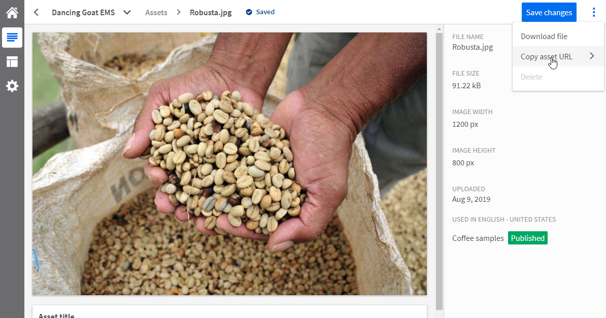

# Publishing content from Kentico EMS to Kentico Kontent

[](https://stackoverflow.com/tags/kentico)

## :warning: **DISCLAIMER** 
This is a *sample* module, it needs detailed testing and maybe some fixing for real production usage. See also [Known issues and TODOs](#known-issues-and-todos).

## Description

This repository contains source code of the Kentico Kontent publishing module for Kentico EMS.

The module automatically synchronizes all published content and assets (media files, page attachments) from a specific site in [Kentico EMS](https://www.kentico.com) to a specific project in [Kentico Kontent](https://kontent.ai) using the Content Management API.

NOTE: The publishing only handles the direction from Kentico EMS to Kentico Kontent, not vice-versa.

The typical use cases for the module are:
* Providing a reliable headless endpoint for your additional channels, e.g. mobile application
  * The data shouldn't be edited in Kentico Kontent, as they may be ovewritten by changes in Kentico EMS. You can still observe and navigate data in Kentico Kontent while developing or debugging your target application.
* Migrating data to Kentico Kontent

## How to use this repository

### Manual installation with the source code from repository

Copy the contents of this repository to the root of your Kentico EMS installation.

You can do that by cloning the repository to a local folder (other than your Kentico EMS folder), and then copy the files over to your Kentico EMS folder.

NOTE: Only the files from following folders are necessary for the module, you can ignore the rest of the files:
* `/Kentico.KontentPublishing`
* `/CMS`

Open the Kentico EMS solution in Visual Studio, and add project **Kentico.KontentPublishing** to the solution.

Include all the content in folder `/CMS/CMSModules/Kentico.KontentPublishing` to the CMSApp project.

Add **reference** to project **Kentico.KontentPublishing** to the CMSApp project.

OPTIONAL: In case you have more projects, e.g. an MVC site instance, add the same reference also to those projects. 

**Update Kentico NuGet packages** for the Kentico.KontentPublishing project to the same version as your current hotfix version of Kentico EMS.

**Build the solution**.

### Kentico Kontent Configuration

Create a **new empty project** in [Kentico Kontent](https://app.kontent.ai).

Add the following keys to the web.config (or app.config) of your project(s)

```
<add key="KCSyncSitename" value="[SITE CODE NAME]" />
<add key="KCSyncWebRoot" value="[URL OF THE TARGET WEB SITE]" />
<add key="KCSyncAssetsDomain" value="[KENTICO KONTENT ASSET DOMAIN]" />
<add key="KCSyncProjectID" value="[YOUR PROJECT ID]" />
<add key="KCSyncCMAPIKey" value="[YOUR CM API KEY]" />
```

`KCSyncSitename` is the code name of the site you want to synchronize to Kentico Kontent, e.g. `DancingGoatMvc`

`KCSyncWebRoot` is the root URL of the target site, to which relative URLs will be resolved, e.g. `https://www.dancinggoat.com`

`KCSyncAssetsDomain` is the domain name on which the assets in your Kentico Kontent project will be located. It depends on the geographical location in which your Kentico Kontent project is hosted. e.g. `assets-us-01.kc-usercontent.com`.

The easiest way to learn this domain for your project is to upload a new temporary asset in **Content & Assets**, and then use the **Copy asset URL** action in the actions menu. You can find the domain in the copy dialog.



After you get the domain name, you can delete the asset.

`KCSyncProjectID` and `KCSyncCMAPIKey` can be found in the **API Keys** section of the **Project settings** of your target Kentico Kontent Project.

Navigate to **Kentico EMS administration -> Sites -> Import Site or objects** and Import package **Kentico.KontentPublishing_1.0.0.zip**. If you properly copied the module files, the package should be offered automatically in this dialog.


Refresh the administration.

Now the **Kentico Kontent Publishing** module should be available.

### Synchronize content to Kentico Kontent


Navigate to application **Kentico Kontent Publishing**.

Click **Synchronize all** to copy all currently published content to Kentico Kontent and wait until the synchronization finishes.


After the synchronization, Kentico Kontent will be populated with all the published content. Examine it and its structure and if something doesn't fit your needs, consider customization.


New changes to the published content will synchronize automatically.

### Customization

Edit the synchronization code in **KenticoKontentPublishing** project.

Click **Synchronize all** to update all currently published content in Kentico Kontent.

Use **Show advanced actions** for partial updates while customizing code, or for purging of the whole project data.

NOTE: It is not recommended to mix content from Kentico EMS and manually created content in the same project in Kentico Kontent, as the purging process deletes all the content no matter from where it originated.

### Migrating content to Kentico Kontent

This module is able to transfer all the content and assets from Kentico EMS to Kentico Kontent.

In case you would like to embrace fully headless CMS, migrate your content and continue editing it in Kentico Kontent, set up the module the same way, run full synchronization as described above, and then remove the module from your Kentico EMS instance.

NOTE: The module synchronizes only published content. If you have any unpublished content that you wish to migrate, publish it before the data migration. 

Continue with the editing in Kentico Kontent.

### Development

You can merge this repository with your existing Kentico EMS project and make commits to it provided it doesn't have it's own git repository.

Follow the installation guide, but instead of cloning the repository to another folder and copying it over to your installation, clone it directly to your existing Kentico EMS installation.

Run the following commands in command line:

```
cd your/kentico/ems/root/folder
git init
echo * > .gitignore
git remote add origin https://github.com/Kentico/ems-module-kontent-publishing.git
git fetch
git checkout origin/master -b master
```

After this, you can easily edit the code, and commit changes to the original repository. Feel free to submit any pull requests with fixed or enhanced functionality.

### Module uninstallation

In order to remove the module from Kentico EMS instance, do the following:

Remove Kentico.KontentPublishing project from your solution(s).

Remove all files brought by this repository.

Delete the module Kentico Kontent Publishing from Kentico EMS Administration interface.

Rebuild the solution(s).


### Known issues

Field type changes which would change the element type in the Kontent content type are not supported. E.g. changing number to text.

## [Questions & Support](https://github.com/Kentico/Home/blob/master/README.md)
